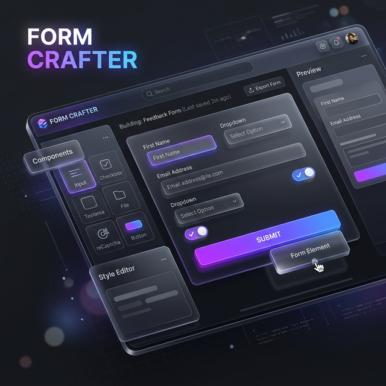

# <p align="center">✨ Form Crafter ✨</p>

<p align="center">
  
</p>

<p align="center">
  <strong>The Future of Business Document Crafting</strong><br>
  <em>A Premium, High-Performance Drag & Drop Form Builder</em>
</p>

---

## 🌐 Experience It Live

<p align="center">
  <a href="https://kriss2012.github.io/form-crafter/">
    
  </a>
  &nbsp;
  <a href="https://formmaker-api.onrender.com/api/">
    
  </a>
</p>

---

## 💎 Project Overview
**Form Crafter** is a state-of-the-art web application designed for people who need professional results without technical complexity. Whether you're drafting legal contracts or business feedback forms, Form Crafter provides a fluid, 3D-inspired workspace that makes design feel like play.

### 🚀 Key Highlights
> [!IMPORTANT]
> **Accessibility First**: Designed to be usable by everyone, including elderly and non-technical users.

- 🛠️ **Seamless Drag & Drop**: A glassmorphism-inspired canvas that responds instantly to your touch.
- 🎨 **Rich Element Library**: From simple text fields to complex **3D-rendered signature pads**.
- 📱 **Multi-Device Mastery**: Real-time 3D viewport switching for Desktop, Tablet, and Mobile.
- ☁️ **Cloud Synergy**: Automatic synchronization with a permanent PostgreSQL backend.

---

## 🏗️ The Tech Stack

| Layer | Technology |
| :--- | :--- |
| **Frontend** | Blazor WebAssembly (.NET 8) |
| **UI Design** | MudBlazor Premium Components |
| **Backend** | Azure Functions (Isolated Worker) |
| **Data** | PostgreSQL via Neon.tech |
| **DevOps** | Docker & GitHub Actions |

---

## 💻 Get Started Locally

```bash
# 1. Clone the project
git clone https://github.com/kriss2012/form-crafter.git

# 2. Spin up the Backend
cd FormMaker.Api && dotnet run

# 3. Launch the Designer
cd ../FormMaker.Client && dotnet run
```

---

## 📄 Advanced Resources
- 📘 [Complete Deployment Guide](DEPLOYMENT-RENDER.md)
- 🗄️ [Database Configuration](DEPLOYMENT-RENDER.md#database-setup)

---

<p align="center">
  Built with ❤️ by <strong>kriss2012</strong>
</p>
